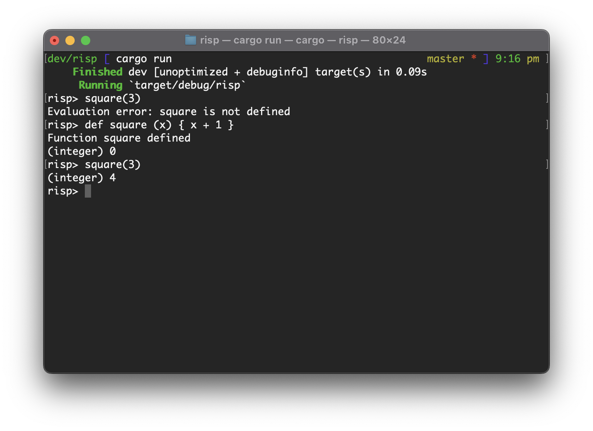

# Risp

Risp is a programming environment. It's implemented in Rust and compiles to x86-64 at runtime to execute it.

This is SUPER hacky and will probably fail to run all but the simplest programs. It may even eat your homework.

## Features

- [x] Basic arithmetic expressions, e.g. `1 + 2 + 3 * 4` evaluates to `15`.
- [x] Function definitions and evaluation, e.g. `def add_one (x) { 1 + x } add_one(41)` evaluates to `42`.

## How to use it

1. Install Rust via Rustup.
2. Build the project using `cargo build`.
3. Run the Risp environment with `cargo run`.
